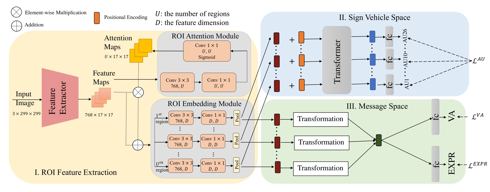

# The Multitask EmotionNet in the ABAW3 challenge

We participated in the [ABAW3 MTL Challenge](https://ibug.doc.ic.ac.uk/resources/cvpr-2022-3rd-abaw/) held in conjunction with CVPR2022. Our team name is NISL-2022. 

Leaderboard is [here](https://drive.google.com/file/d/1rTLFTQaVZOrtB17WrTOH7m038TwdLIPB/view). We won the first place in the MTL challenge!

This repository contains the code for our Multitask EmotionNet (the static and temporal approaches).

# Dependency

Install the dependencies with the `requirements.txt` in `MTL/`:
```
pip install requirements.txt
```

# Model Architecture




